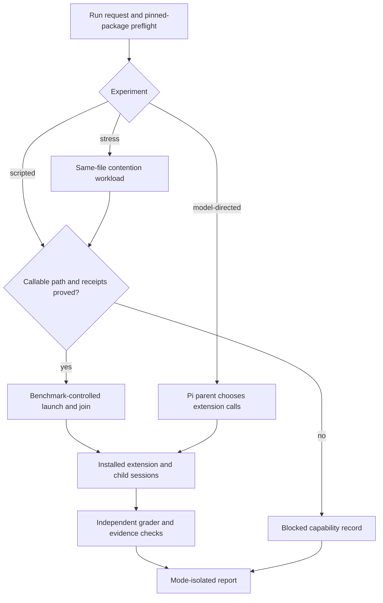
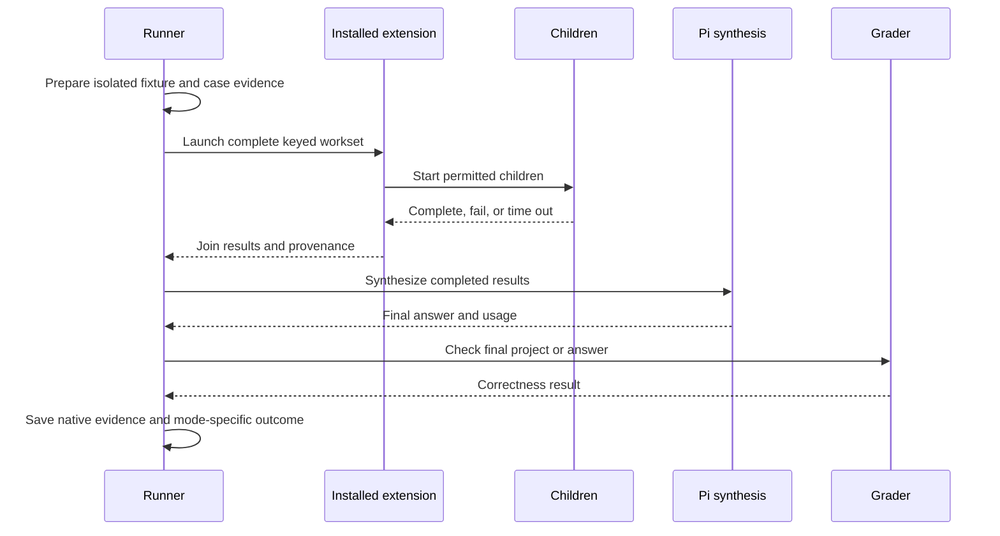
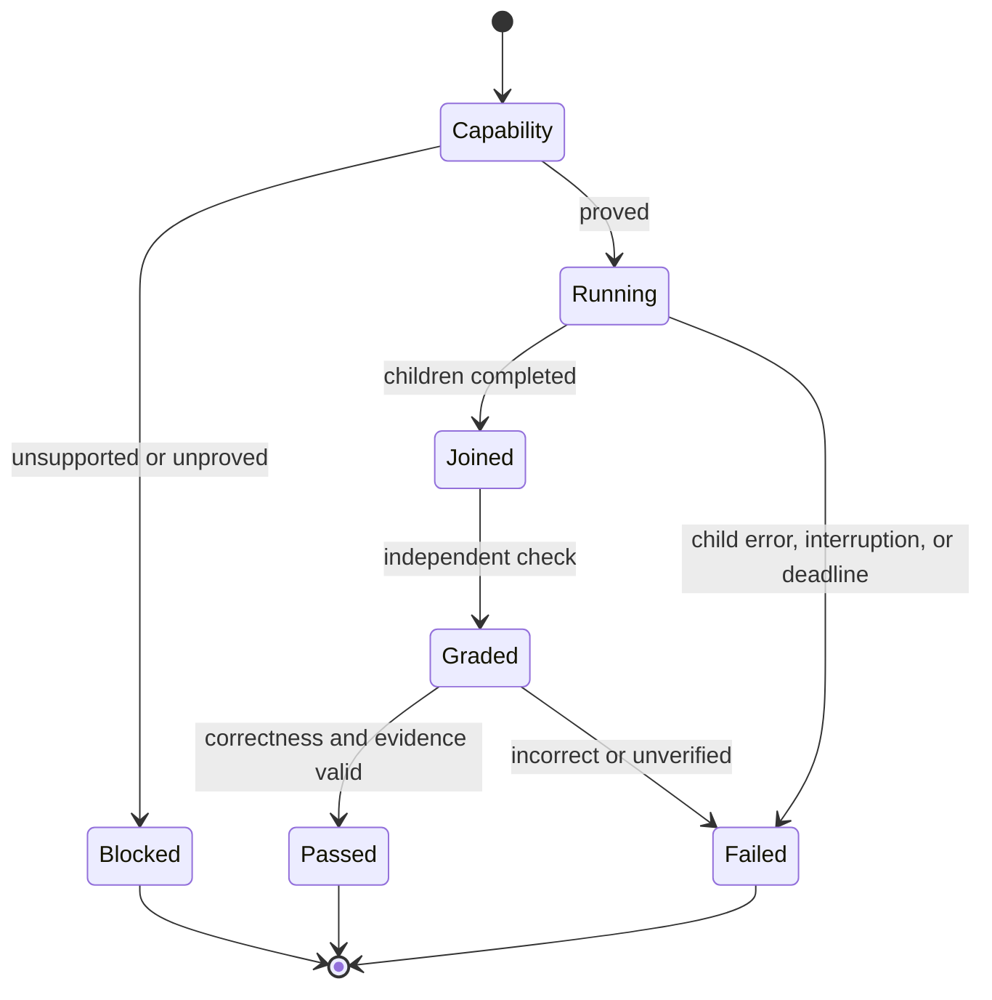

# Scripted parallel benchmark - Plan

## Goal Capsule

**Objective:** Operators can compare the parallel-work extensions on the same tasks without mistaking parent tool-order choices or diagnostic output for extension execution failures.

**Means:** A benchmark-controlled scripted lane, with separate model-directed and same-file contention results (KTD1, KTD2).

**Stop conditions:** Never label a prompt-driven call scripted. Do not include an arm in a paid scripted matrix until its pinned package has a proved callable path and admissible completion and usage evidence. Missing child evidence, incorrect work, and genuine timeouts remain failures.

---

## Product Contract

### Summary

Make scripted extension execution the primary comparison while retaining model-directed tool use and same-file contention as separate tests. Preserve independent grading and the existing isolation and evidence standards.

### Problem Frame

The recorded 60-cell matrix graded all fixtures correct but rejected 17 cells. The parent model made extra calls when case instructions requested tests or reconciliation that arm rules prohibited; other cells timed out or contained relay diagnostics in JSONL. The current scripts live in prompts, so the model still chooses when and whether to invoke them. The pass rate conflates task quality, orchestration choices, and logging defects.

### Key Decisions

- **Scripted execution is the primary comparison.** Keep model-directed tool selection in a separately reported test. Governs R1, R2, R7. (session-settled: user-approved — chosen over a single prompt-driven score: ordering should not dominate extension measurements.)
- **Same-file contention is a separate stress test.** Give each file one concurrent owner in the main comparison. Governs R4. (session-settled: user-approved — chosen over including write races in ordinary medians: contention has a different outcome and risk.)

### Requirements

**Execution and comparison**

- R1. In scripted cells, the benchmark, not the parent model, invokes the pinned extension's child operation and completes the required launches before collection; an unproved callable path blocks that arm before a paid trial.
- R2. Model-directed cells continue to measure the parent's choice of extension calls, but neither their timing nor their pass denominator is pooled with scripted cells.
- R3. Every comparison preserves fresh project copies, the Pi wrapper, pinned package isolation, provider/model/thinking, permitted child tools, deadlines, external grading, and a like-mode stock baseline.
- R4. The main integration task has one owner for both changes to `shipping.py`; the original four-child same-file task remains a separately labeled stress case and cannot enter the main speedup.

**Evidence and failure handling**

- R5. A passing delegated cell requires real completed child results, expected task identity and runtime settings, known usage, and evidenced overlap where multiple children are expected; absent evidence is unknown, not zero.
- R6. The runner keeps raw output and distinguishes known relay diagnostics from unexpected non-JSON event corruption. A task or child failure, deadline, or interruption is still a failed or blocked cell, never an automatic retry.
- R7. Saved cells and rebuilt reports identify scripted, model-directed, stress, and historical mode-less results with their case version; comparisons never cross those boundaries or pool different work definitions.

### Success Criteria

- Offline fixtures reject missing, sequential, duplicated, or wrong-model children in scripted mode and accept out-of-order completion after a valid full launch.
- One scripted repetition per main case and planned arm records no failure caused only by contradictory parent instructions, launch ordering, or known relay diagnostics. This is a gate before another paid scripted matrix, not a promise that every child will finish or every repair will be correct.

### Scope Boundaries

The plan changes the local benchmark, case instructions, and reports. It does not modify Pi or published packages, rewrite the 60-cell historical run, add hidden retries, or count unavailable telemetry as success. The separate contention test may expose genuine lost edits; that remains its result rather than a defect to hide.

---

## Planning Contract

### Key Technical Decisions

- KTD1. **Prove a package operation, not an import.** The current `build_prompt()` embeds scripts in model text, and the inspected pinned Pi SDK/RPC documentation does not establish a generic direct-tool-call API. An arm needs a version-pinned receipt for dispatch through the installed package, joined completion, cancellation, native child identity and telemetry, without a model choosing the call. The proof also checks the filtered cell environment, Pi wrapper route, child tool allowlist, and fresh-project working directory required by R3. Prefer a supported callable path; use a narrow local adapter only if it preserves those semantics. Otherwise block that arm, with no model-directed fallback (R1). An importable entrypoint alone proves nothing.
- KTD2. **Separate experiment identities and gates.** Keep the existing prompt-driven path as model-directed. Persist mode and case version, pair ordinary runs only against a same-mode stock baseline, and label old mode-less artifacts as legacy without rewriting or pooling them with current work (R2, R7). Split global wrapper/fixture failures from per-package capability failures. A package block appears in capability coverage, not the attempted-cell pass rate; supported single-arm cells remain runnable, but a full matrix stops before payment if any planned arm is blocked. Current `preflight()` and `build_report()` lack those distinctions.
- KTD3. **Keep the installed package as the child executor.** Reuse `_child_tasks()`, `_fabric_script()`, and `_tintin_agent_specs()` as intent sources while the benchmark owns scheduling: one foreground `runs.all` workflow, all Tintin background `Agent` launches before result waits, and one Fabric `Promise.all` program. Scripted validation consumes proved package receipts rather than requiring model-produced Pi tool-call events; model-directed validation retains the current tool-call contract. Never fabricate Pi events (R1, R5).
- KTD4. **Move shared preparation and verification out of parent prompts.** The runner records debug's initial failing tests before the measured execution for every arm; the independent grader runs after execution, as it does today. Main integration gives the shipping file one child owner. The separate stress case retains four concurrent tasks, uses the U1-proved benchmark-controlled launch, and checks final behavior and evidence of actual same-file edits without a paired stock speedup (R3, R4).
- KTD5. **Measure comparable end-to-end work and preserve provenance.** Start each cell's clock after fixture preparation, including runtime startup, dispatch, joins, and a same-model synthesis of child results; stop it at the final answer and record external grading separately. Stock retains its full Pi task time under that boundary, and scripted dispatch and synthesis costs stay visible rather than disappearing from the speedup. Use package/session records for child settings, turns, usage, and overlap. Fabric's current runner-wrapped `agents.run` timestamps are not native child start and end; missing native timing leaves overlap unknown and the parallel cell invalid (R3, R5).
- KTD6. **Classify diagnostics narrowly.** Capture stdout JSONL and stderr separately, and recognize only confirmed exact relay signatures when unavoidable. Count those diagnostics in the artifact; fail unknown malformed lines. Do not weaken launch, settlement, or correctness checks to compensate for contaminated output (R6).

### High-Level Technical Design

The first gate is capability, not a paid cell. The diagrams show intended boundaries; they do not specify an SDK API that has not been proved.

### Risks and prerequisites

- Scripted invocation is not established by the current CLI, RPC, or SDK documentation. U1 must demonstrate the real package path without a paid matrix; inability to preserve the pinned package's behavior and evidence blocks the corresponding arm. A wrapper around a model prompt does not pass this gate.
- Package-specific receipts differ. Keep provenance in the cell instead of replacing package evidence with runner timestamps or estimated child spend.
- A scripted run removes parent tool-choice latency; historical model-directed speedups are not comparable. Keep time and token boundaries visible, and do not infer a winner from incomplete samples.
- The active checkout includes uncommitted Tintin changes. Implementers must reconcile that baseline with the plan before touching the runner; the artifact does not modify or discard those changes.

### System-Wide Impact

Benchmark operators, archived-report readers, and anyone comparing stock against extensions will see distinct experimental populations (KTD2). The synthesis step adds a second Pi session boundary to scripted cells, so cost and latency attribution must include it (KTD5). Package pins, wrapper authentication, and private fixture isolation stay in place; no published extension API is changed.

---

## Implementation Units

### U1. Establish the scripted capability gate

**Goal:** Identify a verified callable execution and completion path for each pinned extension without asking a model to choose the call (R1, R3, R5; KTD1).

**Dependencies:** None.

**Files:** `benchmark.py`, `tests/test_benchmark.py`, `tests/test_benchmark_expansion.py`.

**Approach:** Extend package preflight and child-evidence boundaries, not a general orchestration framework. Establish for each pin an accepted launch, joined completion, child identity, usage/lifecycle provenance, error, and cancellation receipt through the actual package operation. Prove that a local adapter inherits only `build_environment()`'s filtered cell credentials, uses the Pi wrapper for descendants, and keeps each child's tools and cwd inside the permitted fresh fixture. A static import or mocked entry is insufficient; require an isolated version-matched execution proof before admitting a paid scripted comparison. If neither a supported path nor a narrow equivalent adapter preserves those receipts, block that arm before a paid cell.

**Patterns to follow:** `preflight()`, `build_environment()`, `_completed_tool_calls()`, and `extract_children()` in `benchmark.py`.

**Test scenarios:**
- With a proved package operation and complete native child receipts, capability checking admits scripted execution without a parent model tool call.
- With only an importable entry, missing receipt field, or prompt-driven substitute, capability checking blocks that arm while preserving supported arms.
- An adapter that gives a child a broader tool set, inherited host credentials, a non-wrapper Pi binary, or a cwd outside the cell project is blocked before a paid trial.
- A wrapper or fixture failure blocks the whole run rather than masquerading as one unsupported package.
- When the callable operation fails or cancellation fires, child work stops and the cell retains a failure receipt rather than starting a retry.

**Verification:** An admitted arm has a version-pinned dispatch-and-join proof with the fields its scripted validator needs; unsupported arms are visibly blocked.

### U2. Isolate experiment modes and stored results

**Goal:** Give the operator separate scripted, model-directed, and stress identities with valid same-mode comparisons (R2, R7; KTD2).

**Dependencies:** None. Model a blocked capability outcome before U1 proves any package; connect its actual proof later.

**Files:** `benchmark.py`, `tests/test_benchmark.py`, `tests/test_benchmark_expansion.py`, `README.md`.

**Approach:** Extend `run`, `smoke`, `matrix`, saved cell identities, and `report` using the existing manifest and report functions. Keep mode-less artifacts readable as their own legacy case version and preserve their bytes; never pair them with new model-directed, scripted, or stress cells. Report capability coverage separately from attempted-cell pass rates. Scripted is the primary selection only for supported arms; stress is opt-in. A stock baseline is labeled for the ordinary comparison it belongs to.

**Patterns to follow:** `_create_run()`, `matrix_schedule()`, `_load_cells()`, and `build_report()` in `benchmark.py`.

**Test scenarios:**
- Scripted and model-directed trials of the same case, arm, and repetition save to distinct cells and produce distinct pass denominators.
- A report rebuilt from old mode-less cells retains historical values, labels the historical case version, and never pools or pairs them with new model-directed, scripted, or stress cells.
- A blocked scripted arm appears in capability coverage, not as a failed execution trial; supported single-arm cells remain available, while a full matrix stops with blocked arms visible instead of replacing them.
- Stress cells never enter ordinary medians or paired stock speedups.

**Verification:** JSON and Markdown reports agree on mode, planned/attempted/blocked counts, and within-mode paired samples.

### U3. Drive each package in a fixed launch-and-join sequence

**Goal:** Remove parent-model scheduling from scripted cells while preserving real installed-extension work (R1, R3, R5, R6; KTD3, KTD5).

**Dependencies:** U1, U2.

**Files:** `benchmark.py`, `tests/test_benchmark.py`, `tests/test_benchmark_expansion.py`.

**Approach:** Reuse existing child task definitions and per-arm settings. Wire only U1-proved entrypoints. Bind task keys to returned IDs, collect each result once, and validate native completion, settings, usage, and overlap through scripted-specific receipts. Follow joins with a same-model, tool-restricted synthesis step so parent time and tokens remain measured. Keep the original prompt path and validator for model-directed runs; cancel the entire child tree at the cell deadline.

**Patterns to follow:** `_child_tasks()`, `_fabric_script()`, `_tintin_agent_specs()`, `run_process()`, and `overlap_summary()` in `benchmark.py`.

**Test scenarios:**
- For three Tintin tasks, all background launches precede any wait; shuffled completions still map to the right task keys and pass when results are complete.
- One `runs.all` workset or one Fabric parallel program yields native child receipts without a model-produced tool-call event.
- A successful join passes results into synthesis; elapsed time and usage include startup, dispatch, child work, and same-model synthesis, not external setup or grading.
- A duplicate ID, missing result, wrong model/thinking level, serial child execution, failed child, or unknown usage cannot produce a passing parallel cell.
- A deadline while children are active cancels descendants, preserves artifacts, and prevents later writes into the next cell.

**Verification:** Offline event and session fixtures establish the exact ordering and negative cases before any paid run.

### U4. Align cases with independent ownership and checks

**Goal:** Keep failure-driven repair and cross-module integration while removing contradictory parent instructions from the main comparison (R3, R4; KTD4).

**Dependencies:** U2 for the stress case identity; case instruction and debug fixes do not depend on U3.

**Files:** `benchmark.py`, `cases/debug.md`, `cases/integration.md`, `checks/patch.py`, `tests/test_benchmark_expansion.py`.

**Approach:** Run and retain debug's initial failing-test evidence for every arm outside the timed parent step; let the external grader verify the final state. Assign both shipping changes to one child in the main integration case. Retain the four-task stress variant under its own identity; after U1's capability proof, wire it to the benchmark-controlled launch and record same-file edit evidence and the final grade. Do not describe successful final code as proof that a write collision occurred.

**Patterns to follow:** Existing case text, `fixtures/project/test_contracts.py`, `_child_tasks()`, and the independent `checks/patch.py` integration grader.

**Test scenarios:**
- The debug case starts from captured failing contracts, gives every arm the same failure evidence, and grades the repaired fixture without a forbidden parent test command.
- Three main integration owners repair catalog, billing, and both shipping functions; the grader checks the grand total and the original return keys.
- The four-child stress case records the two `shipping.py` edit attempts and their observed file revisions or hunks, not only overlapping sessions; a lost edit fails the final check, and absent edit evidence leaves contention unknown.

**Verification:** Main-case correctness and stress-case contention use distinct results and both retain independent fixture grading.

### U5. Keep diagnostic output out of false failures

**Goal:** Stop known relay diagnostics from invalidating otherwise complete cells without concealing JSONL corruption (R5, R6; KTD6).

**Dependencies:** None; the existing model-directed JSONL reader already needs this fix.

**Files:** `benchmark.py`, `tests/test_benchmark.py`.

**Approach:** Prefer routing relay diagnostics to stderr for both experiment modes. Where the wrapper emits an unavoidable known marker on stdout, recognize its exact signature, retain/count it in raw artifacts, and keep unknown non-JSON lines fatal. Do not infer launches from diagnostic text or synthetic events.

**Patterns to follow:** `run_process()`, `read_events()`, and the existing malformed-line regression tests.

**Test scenarios:**
- A captured headroom or Serena relay marker alongside valid JSONL increments a diagnostic count and leaves task, launch, and usage evidence unchanged.
- An arbitrary non-JSON line or truncated event still marks the event stream malformed.
- A late diagnostic after an assistant stop does not erase an earlier non-empty final answer or manufacture settlement.

**Verification:** Archived event traces reproduce the old false failure and show only known diagnostic lines change classification.

### U6. Validate and document the new comparison

**Goal:** Make the operator-facing run procedure honest before spending on another full matrix (R1-R7).

**Dependencies:** U1-U5.

**Files:** `README.md`, `tests/test_benchmark.py`, `tests/test_benchmark_expansion.py`.

**Approach:** Document mode meanings, capability blocking, clock boundaries, stress selection, evidence provenance, and partial telemetry. Use the current offline suite and archived traces first. Gate a paid scripted matrix on one scripted cell per main case and proved arm, plus its labeled stock baseline, with no ordering-only or known-diagnostic failures. Model-directed ordering remains a measured outcome, not a gate failure. Do not automatically rerun failed cells.

**Test scenarios:**
- The documented scripted run never falls back to a prompt-driven extension call when an arm is blocked.
- A mode-specific report shows a passing task with missing child evidence as invalid, not successful.
- A missing or failed scripted case-by-arm gate prevents a full matrix; a model-directed ordering failure does not masquerade as a failed scripted gate.
- A matrix started after a passing gate stores attempted failures and excludes stress and legacy cells from main comparisons.

**Verification:** Offline tests, per-case gate artifacts, and regenerated reports support every displayed comparison; abandoned adapter experiments are absent from the final diff.

---

## Verification Contract

- Run the existing `PYTHONDONTWRITEBYTECODE=1 python3 -m unittest discover -s tests` suite after each behavior-bearing unit; add focused fixtures for its cases rather than using a paid run as the first test.
- Run `python3 benchmark.py preflight` and prove the scripted callable path for each installed pin without a billable matrix. A failed proof blocks that arm.
- Replay saved valid and invalid JSONL/session traces for launch order, overlap, diagnostics, incomplete usage, old report compatibility, and timeout cleanup. Historical artifacts remain unchanged.
- After offline checks pass, run one scripted cell per main case and proved arm, with its same-mode stock baseline under the same deadline. Review correctness, launch provenance, child model/thinking, usage, overlap, and failed-cell reasons before authorizing one full paired matrix. Model-directed ordering is reported separately; genuine runtime and correctness failures remain failures.

---

## Definition of Done

- Every admitted scripted arm uses a verified package operation without model-selected launch order; unsupported arms are blocked before paid cells, never relabeled.
- The model-directed and contention paths remain available and cannot contaminate scripted denominators or speedups. Old reports are readable with a truthful legacy label.
- Debug and main integration no longer direct a parent into tools its validator forbids. Native child and telemetry checks still reject real missing, serial, mismatched, or failed work.
- Known relay messages no longer count as malformed JSONL; other corruption still does. Every raw event and timeout artifact remains auditable.
- Tests and the per-case gate pass for the new behavior before a matrix is requested. Remove abandoned proof-of-concept adapters and unrelated cleanup from the final diff.

---

## Sources and research

- `benchmark.py` and `tests/test_benchmark_expansion.py` define the current prompt-driven launch, evidence, reporting, and test seams.
- `cases/debug.md`, `cases/integration.md`, and `checks/patch.py` establish case behavior and independent grading.
- `README.md` documents the existing run and measurement contract.
- `docs/plans/2026-09-29-1130-feat-pi-parallel-benchmark-plan.md` records the original isolation and fairness decisions; this plan extends the existing benchmark rather than replacing that document.
